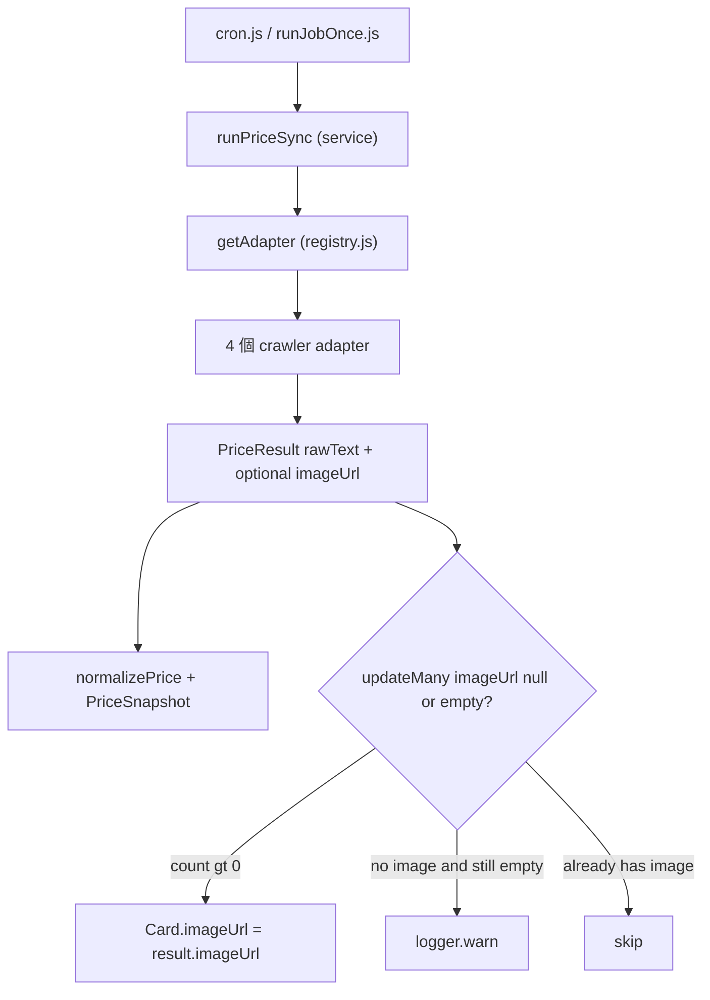

# 抓價 Adapter 開發規格書（Crawler / Integration）

## 1. 範圍與責任邊界

本規格對應 PRD 第二十章角色「Crawler / Integration」，交付項目為 PRD FR-07 / FR-14。

重要前提：整條資料管線骨架**已存在**，本工作不是從零建系統，而是把 mock adapter 換成真實來源。

- 已完成、**本工作不需修改**：`registry.js` 之外的編排、`withTimeout`（timeout）、`normalizePrice`（清洗）、`cron.js`（排程）、`runJobOnce.js`（手動觸發）。
- 本工作**需交付**：`adapters/crawler/` 下 4 個真實 crawler adapter（cardLand / rakuten / priceCharting / yuyutei）、於 `registry.js` 註冊、對應的真實 `PriceSource` 資料。
- **後續擴充**：`PriceResult.imageUrl` 可選欄位；[`priceSync.service.js`](apps/api/src/services/priceSync.service.js) 負責條件寫入 `Card.imageUrl`（見 §2「可選 imageUrl」）。

責任分層（不可越界）：

- adapter 只做「連線 + 抓取 + 解析成 `PriceResult`」（含可選 `imageUrl`）。
- 不在 adapter 內：寫 DB、清洗數字、設 timeout、管 job 狀態（皆為 service 責任）。

## 2. 介面契約（不可更改）

所有 adapter 輸出必須通過 [apps/api/src/adapters/contract.js](apps/api/src/adapters/contract.js) 的 `assertPriceResult`：

- `provider: string`
- `currency: string`（必填）
- `rawText?: string`（本次 4 個 crawler 都填這個，保留 `¥12,345` / `$948.43` 原始文字，**不自己清洗**）
- `price?: number`（API 來源用；本次不使用）
- `fetchedAt: string`（ISO 時間）
- `imageUrl?: string`（可選；同次抓取得到的卡圖 URL。**缺圖不 throw**，省略欄位即可；空白字串會被 `assertPriceResult` 刪掉）

adapter 物件形狀：`{ type, name, async fetchPrice(source) }`，本次 `type` 一律為 `'crawler'`，`name` 對應 `PriceSource.provider`。

service 會統一清洗：`normalizePrice(result.rawText ?? result.price)`（見 [apps/api/src/services/priceSync.service.js](apps/api/src/services/priceSync.service.js)）。

### 可選 imageUrl

**Adapter 端**

- 在既有 HTML 解析時順便取圖（各 adapter 的 `IMAGE_SELECTOR`，與 `PRICE_SELECTOR` 並列）。
- 相對路徑用 [`resolveImageUrl.js`](apps/api/src/adapters/resolveImageUrl.js)（`new URL(href, source.url)`）轉成絕對 URL；無效則省略。
- 找不到圖 → **不 throw**，回傳結果不帶 `imageUrl`（價格找不到仍維持 throw）。
- mock adapter（`mockCrawler` / `mockApi`）**不回傳** `imageUrl`。

**Service 端寫入**（[`priceSync.service.js`](apps/api/src/services/priceSync.service.js) `processOneSource`）

- 價格摘要（`latestPrice` / `latestCurrency` / `lastFetchedAt`）每次成功都更新。
- 圖片用 **原子條件寫入**，避免同 job 多來源覆寫、也不依賴 job 開頭的 `source.card` 快照：

```js
await tx.card.updateMany({
  where: {
    id: source.cardId,
    OR: [{ imageUrl: null }, { imageUrl: '' }],
  },
  data: { imageUrl },
});
```

- 僅當結果有合法 `http(s)` URL，且 DB 上 `Card.imageUrl` 仍為空（`null` / `''`）時才寫入；`count > 0` 時 `logger.info`。
- 結果無圖時，在 transaction 內重讀卡牌；若仍無圖則 `logger.warn`（前面來源已補過圖則不 warn）。
- 同卡多來源：誰先成功寫入就留下；後續來源的 `updateMany` 影響列數為 0，不覆寫。
- 圖片不影響價格成功／失敗判定。

## 3. 資料流（整合位置）



本工作 crawler adapter 負責產出 `PriceResult`；圖片寫入規則在 service。

## 4. Crawler adapter 規格（通用模板）

4 個檔案，各自對應一個來源：

- [apps/api/src/adapters/crawler/cardLand.adapter.js](apps/api/src/adapters/crawler/cardLand.adapter.js)（`name: cardLand`）
- [apps/api/src/adapters/crawler/rakuten.adapter.js](apps/api/src/adapters/crawler/rakuten.adapter.js)（`name: rakuten`）
- [apps/api/src/adapters/crawler/priceCharting.adapter.js](apps/api/src/adapters/crawler/priceCharting.adapter.js)（`name: priceCharting`）
- [apps/api/src/adapters/crawler/yuyutei.adapter.js](apps/api/src/adapters/crawler/yuyutei.adapter.js)（`name: yuyutei`）

共同模板：

- 用 `fetch(source.url, { headers: { 'User-Agent': ... } })` 抓 HTML。
- 用 `cheerio` 解析。文字型價格用 `$(selector).first().text().trim()`；屬性型價格（如 rakuten 的 `meta[itemprop="price"]`）用 `$(selector).first().attr('content')`。
- 價格 selector 找不到 → `throw new Error('找不到價格 selector（頁面可能改版）')`（PRD 第十八章）。
- 圖片 selector 找不到 → 省略 `imageUrl`，不 throw。
- 回傳 `rawText`（保留符號 / 逗號），不自己轉數字；可選帶 `imageUrl`。
- **換來源只改** `PRICE_SELECTOR` / `IMAGE_SELECTOR`（及取屬性方式）。
- 需新增依賴：`npm i cheerio -w @pct/api`。

各來源 selector：

| provider | 價格 selector | 圖片 selector |
| -------- | ------------- | ------------- |
| cardLand | `p.price.product-page-price`（text） | `meta[property="og:image"]`（`content`） |
| rakuten | `meta[itemprop="price"]`（`content`） | `meta[property="og:image"]`（`content`） |
| priceCharting | `#used_price .price.js-price`（text） | `#product_details img[itemprop="image"]`（`src`） |
| yuyutei | `h4.fw-bold.d-inline-block`（text） | `img.vimg`（`src`） |

## 5. 註冊（唯一需碰的既有檔）

[apps/api/src/adapters/registry.js](apps/api/src/adapters/registry.js)：import 4 個新 crawler adapter，加進 `adapters` 陣列即可，service / scheduler 不動。

## 6. 開發流程

1. 階段 0 可行性驗證：對 4 個候選來源做 `curl` 測試，確認 HTML 原始碼直接含價格文字或可解析的價格屬性（否則為 JS 動態渲染，需換來源或改 Playwright）。
2. 實作 4 個 crawler adapter，import `assertPriceResult`；用 repo 內的測試 HTML（`apps/api/src/adapters/crawler/fixtures/`）以 cheerio 驗證各 selector 抓得到值。
3. 於 [apps/api/src/adapters/registry.js](apps/api/src/adapters/registry.js) 註冊 adapter。
4. 階段 3：DB 建真實資料——**4 張卡牌，各掛 1 筆 crawler `PriceSource`**（來源 URL 對應不同商品頁，不可併到同一張卡），再跑抓價驗證快照落地。
  - 建資料：`npm run seed:real-sources`（腳本：[apps/api/src/scripts/seedRealSources.js](apps/api/src/scripts/seedRealSources.js)）
  - 逐卡：`npm run job:once -w @pct/api -- <cardId>`；或一次全跑：`npm run job:once`
5. 階段 4：跑錯誤情境 + 準備 mock 備援。

## 7. 錯誤處理驗收（對應 PRD 第十八章 / 成功指標）

- selector 改壞 / 頁面改版 → adapter throw → 進 `PriceFetchLog`（failed），job = `partial_success`。
- 來源回非 200（含被限流） → adapter throw `HTTP <status>`，不無限重試。
- 來源過慢 → 由 service `withTimeout`（預設 10s，`FETCH_TIMEOUT_MS`）擋下。
- 空 / 0 / NaN / Infinity → 由 `normalizePrice` 擋下，不寫入快照。
- 缺圖（價格成功）→ 不 throw；service 在卡仍無圖時 `warn`，有合法 URL 且卡為空時原子寫入（見 §2）。
- Demo 備援：保留 mock adapter，來源當天掛掉仍能展示（PRD 第二十九章）。

## 8. 階段 3 整合驗收（已完成）

`seed:real-sources` 會建立以下 4 組「卡牌 ↔ 來源」（各 1 對 1）：


| provider      | 卡牌                         | 卡號      | setName       | language | currency |
| ------------- | -------------------------- | ------- | ------------- | -------- | -------- |
| cardLand      | 超級皮可西ex                    | 112/080 | 虛無歸零 M3       | zh       | HKD      |
| yuyutei       | SR ヤドン＆コダックGX              | 095/094 | ミラクルツイン       | ja       | JPY      |
| priceCharting | Pikachu with Grey Felt Hat | 085/S-P | Pokemon Promo | en       | USD      |
| rakuten       | ニンフィア                      | 2-4-037 | ポケモンフレンダ      | ja       | JPY      |


執行方式：

```bash
npm run seed:real-sources
# 腳本會印出 4 個 cardId；逐卡驗證：
npm run job:once -w @pct/api -- <cardId>
# 或一次抓全部啟用來源：
npm run job:once
```

驗證結果（每張卡各自 1 來源成功即可）：

- Job 狀態：逐卡跑時為 `success`（1 / 1）；全跑時依當下啟用來源數結算
- 每張卡各 1 筆 `PriceSnapshot`、1 筆 `PriceFetchLog`（`success`）
- 各卡 `Card.latestPrice` 已更新
- 若卡原本無 `imageUrl` 且來源 HTML 可解析出圖，應寫入 `Card.imageUrl`（空才寫、不覆寫）

各來源曾驗證到的價格樣例（2026-07-12）：


| provider      | rawText  | price | currency |
| ------------- | -------- | ----- | -------- |
| cardLand      | $200     | 200   | HKD      |
| yuyutei       | 17,800 円 | 17800 | JPY      |
| priceCharting | $922.00  | 922   | USD      |
| rakuten       | 170      | 170   | JPY      |


## 9. 階段 4 自動化驗收（已完成）

執行方式（repo 根目錄）：

```bash
npm test
```

測試檔：

- [apps/api/src/adapters/crawler/crawler.error-cases.test.js](apps/api/src/adapters/crawler/crawler.error-cases.test.js) — adapter 層
- [apps/api/src/services/priceSync.error-cases.test.js](apps/api/src/services/priceSync.error-cases.test.js) — service 整合層（需 PostgreSQL）

覆蓋情境：


| 情境 | 驗證方式 | 預期結果 |
| ---- | -------- | -------- |
| selector 改壞 | mock HTML 不含價格節點 | adapter throw → failed log |
| HTTP 429 | mock fetch 回 429 | adapter throw `HTTP 429` → failed log |
| 空值 / $0 | mock HTML 回 `$0` | normalizePrice 擋下 → failed log，無 snapshot |
| 逾時 | mock fetch 永不 resolve + `FETCH_TIMEOUT_MS=20` | withTimeout 擋下 → failed log |
| 部分成功 | 5 來源中 1 成功 4 失敗 | job = `partial_success`，僅 1 筆 snapshot |
| mock 備援 | provider 未知 | registry 退回 `mockCrawler` |
| 解析 imageUrl | fixture HTML mock fetch | adapter 回傳預期 `imageUrl` |
| 缺圖不 throw | HTML 有價無圖 | 價格成功、`imageUrl` 省略 |
| 空圖才寫入 | 卡已有 `imageUrl` 再抓價 | DB 圖不變 |
| 多來源不覆寫 | 同卡兩來源皆回不同圖 | 保留第一個成功寫入的圖（`updateMany`） |
| adapter 省略圖 | 成功但無 `imageUrl` | 卡 `imageUrl` 仍為 null，job success |


## 10. 不在本次範圍（加分項）

API adapter、`priceTwd` 匯率換算、多來源平均、Playwright 動態渲染、Queue，皆待主流程穩定後再議（PRD 第二十二章）。