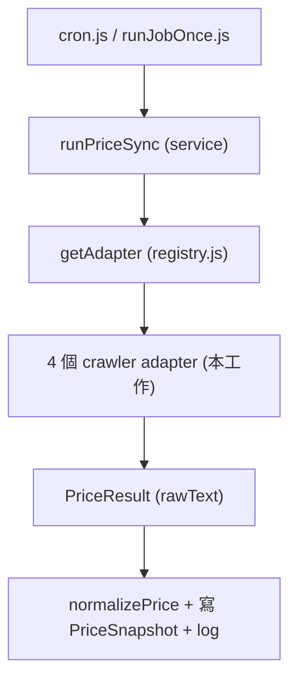

# 抓價 Adapter 開發規格書（Crawler / Integration）


## 1. 範圍與責任邊界

本規格對應 PRD 第二十章角色「Crawler / Integration」，交付項目為 PRD FR-07 / FR-14。

重要前提：整條資料管線骨架**已存在**，本工作不是從零建系統，而是把 mock adapter 換成真實來源。

- 已完成、**本工作不需修改**：`priceSync.service.js`（主流程）、`registry.js` 之外的編排、`withTimeout`（timeout）、`normalizePrice`（清洗）、`cron.js`（排程）、`runJobOnce.js`（手動觸發）。
- 本工作**需交付**：`adapters/crawler/` 下 4 個真實 crawler adapter（cardland / rakuten / priceCharting / yuyutei）、於 `registry.js` 註冊、對應的真實 `PriceSource` 資料。**本次不做 API adapter。**

責任分層（不可越界）：

- adapter 只做「連線 + 抓取 + 解析成 `PriceResult`」。
- 不在 adapter 內：寫 DB、清洗數字、設 timeout、管 job 狀態（皆為 service 責任）。


## 2. 介面契約（不可更改）

所有 adapter 輸出必須通過 [apps/api/src/adapters/contract.js](apps/api/src/adapters/contract.js) 的 `assertPriceResult`：

- `provider: string`
- `currency: string`（必填）
- `rawText?: string`（本次 4 個 crawler 都填這個，保留 `¥12,345` / `$948.43` 原始文字，**不自己清洗**）
- `price?: number`（API 來源用；本次不使用）
- `fetchedAt: string`（ISO 時間）

adapter 物件形狀：`{ type, name, async fetchPrice(source) }`，本次 `type` 一律為 `'crawler'`，`name` 對應 `PriceSource.provider`。

service 會統一清洗：`normalizePrice(result.rawText ?? result.price)`（見 [apps/api/src/services/priceSync.service.js](apps/api/src/services/priceSync.service.js) 第 91 行）。

## 3. 資料流（整合位置）




本工作只負責圖中 crawler adapter 方塊；其餘皆已存在。

## 4. Crawler adapter 規格（通用模板）

4 個檔案，各自對應一個來源：

- [apps/api/src/adapters/crawler/cardland.adapter.js](apps/api/src/adapters/crawler/cardland.adapter.js)（`name: cardland`）
- [apps/api/src/adapters/crawler/rakuten.adapter.js](apps/api/src/adapters/crawler/rakuten.adapter.js)（`name: rakuten`）
- [apps/api/src/adapters/crawler/priceCharting.adapter.js](apps/api/src/adapters/crawler/priceCharting.adapter.js)（`name: pricecharting`）
- [apps/api/src/adapters/crawler/yuyutei.adapter.js](apps/api/src/adapters/crawler/yuyutei.adapter.js)（`name: yuyutei`）

共同模板：

- 用 `fetch(source.url, { headers: { 'User-Agent': ... } })` 抓 HTML。
- 用 `cheerio` 解析。文字型價格用 `$(selector).first().text().trim()`；屬性型價格（如 rakuten 的 `meta[itemprop="price"]`）用 `$(selector).first().attr('content')`。
- selector 找不到 → `throw new Error('找不到價格 selector（頁面可能改版）')`（PRD 第十八章）。
- 回傳 `rawText`（保留符號 / 逗號），不自己轉數字。
- **換來源只改**「價格在哪個 CSS selector」這一段。
- 需新增依賴：`npm i cheerio -w @pct/api`。

各來源 selector：

- cardland：`p.price.product-page-price`
- rakuten：`meta[itemprop="price"]`（取 `content` 屬性）
- pricecharting：`#used_price .price.js-price`
- yuyutei：`h4.fw-bold.d-inline-block`


## 5. 註冊（唯一需碰的既有檔）

[apps/api/src/adapters/registry.js](apps/api/src/adapters/registry.js)：import 4 個新 crawler adapter，加進 `adapters` 陣列即可，service / scheduler 不動。

## 6. 開發流程

1. 階段 0 可行性驗證：對 4 個候選來源做 `curl` 測試，確認 HTML 原始碼直接含價格文字或可解析的價格屬性（否則為 JS 動態渲染，需換來源或改 Playwright）。
2. 實作 4 個 crawler adapter，import `assertPriceResult`；用 repo 內的測試 HTML（`crawler source test htmls/`）以 cheerio 驗證各 selector 抓得到值。
3. 於 [apps/api/src/adapters/registry.js](apps/api/src/adapters/registry.js) 註冊 adapter。
4. 階段 3：DB 建真實 `PriceSource`（4 筆 crawler），跑 `npm run job:once -w @pct/api -- <cardId>` 驗證快照落地。
  - 建資料：`npm run seed:real-sources`（腳本：[apps/api/src/scripts/seedRealSources.js](apps/api/src/scripts/seedRealSources.js)）
5. 階段 4：跑錯誤情境 + 準備 mock 備援。


## 7. 錯誤處理驗收（對應 PRD 第十八章 / 成功指標）

- selector 改壞 / 頁面改版 → adapter throw → 進 `PriceFetchLog`（failed），job = `partial_success`。
- 來源回非 200（含被限流） → adapter throw `HTTP <status>`，不無限重試。
- 來源過慢 → 由 service `withTimeout`（預設 10s，`FETCH_TIMEOUT_MS`）擋下。
- 空 / 0 / NaN / Infinity → 由 `normalizePrice` 擋下，不寫入快照。
- Demo 備援：保留 mock adapter，來源當天掛掉仍能展示（PRD 第二十九章）。


## 8. 階段 3 整合驗收（已完成）

執行方式：

```bash
npm run seed:real-sources
npm run job:once -w @pct/api -- <cardId>
```

驗證結果（2026-07-12）：

- 卡牌：`Pikachu with Grey Felt Hat`（`cmrgnki860000fhtocnqtbjfc`）
- Job 狀態：`success`（4 / 4 來源成功）
- 4 筆 `PriceSnapshot` 已落地
- 4 筆 `PriceFetchLog` 皆為 `success`
- `Card.latestPrice` 已更新


| provider      | rawText  | price | currency |
| ------------- | -------- | ----- | -------- |
| cardland      | $200     | 200   | HKD      |
| yuyutei       | 17,800 円 | 17800 | JPY      |
| pricecharting | $922.00  | 922   | USD      |
| rakuten       | 170      | 170   | JPY      |


## 9. 階段 4 自動化驗收（已完成）

執行方式（repo 根目錄）：

```bash
npm test
```

測試檔：

- [apps/api/src/adapters/crawler/crawler.error-cases.test.js](apps/api/src/adapters/crawler/crawler.error-cases.test.js) — adapter 層
- [apps/api/src/services/priceSync.error-cases.test.js](apps/api/src/services/priceSync.error-cases.test.js) — service 整合層（需 PostgreSQL）

覆蓋情境：


| 情境          | 驗證方式                                          | 預期結果                                      |
| ----------- | --------------------------------------------- | ----------------------------------------- |
| selector 改壞 | mock HTML 不含價格節點                              | adapter throw → failed log                |
| HTTP 429    | mock fetch 回 429                              | adapter throw `HTTP 429` → failed log     |
| 空值 / $0     | mock HTML 回 `$0`                              | normalizePrice 擋下 → failed log，無 snapshot |
| 逾時          | mock fetch 永不 resolve + `FETCH_TIMEOUT_MS=20` | withTimeout 擋下 → failed log               |
| 部分成功        | 5 來源中 1 成功 4 失敗                               | job = `partial_success`，僅 1 筆 snapshot    |
| mock 備援     | provider 未知                                   | registry 退回 `mockCrawler`                 |


修正：`cardland`、`pricecharting` adapter 的 `name` 已對齊 DB `PriceSource.provider` 小寫命名，避免誤走 mock fallback。

## 10. 不在本次範圍（加分項）

API adapter、`priceTwd` 匯率換算、多來源平均、Playwright 動態渲染、Queue，皆待主流程穩定後再議（PRD 第二十二章）。